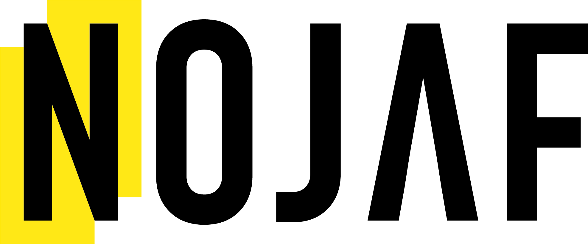

### Open Source Developer 🛠️

I'm Florian Verdonck, a freelance software craftsman at Nojaf BV, specialising in open-source development, consultancy, and training. I help companies succeed with OSS.

My expertise lies in contributing to and maintaining open-source projects. I am involved in the F# community, with contributions to the compiler, tooling, and documentation.

**F# OSS Contributions:**

- [fantomas](https://github.com/fsprojects/fantomas/pulls?q=is%3Apr+author%3Anojaf)
- [dotnet/fsharp](https://github.com/dotnet/fsharp/pulls?q=is%3Apr+author%3Anojaf)
- [FsAutoComplete](https://github.com/fsharp/FsAutoComplete/pulls?q=is%3Apr+author%3Anojaf)
- [JetBrains/resharper-fsharp](https://github.com/JetBrains/resharper-fsharp/pulls?q=is%3Apr+author%3Anojaf)
- [dotnet/docs](https://github.com/dotnet/docs/pulls?q=is%3Apr+author%3Anojaf)

**Let's Connect:**

- 🦋 BlueSky: [@nojaf.com](https://bsky.app/profile/nojaf.com)
- 🐦 Twitter: [@verdonckflorian](http://twitter.com/verdonckflorian)
- 📺 YouTube: [nojaf](https://www.youtube.com/user/nojaf/videos)
- ✉️ Email: florian@nojaf.com
- 🗓️ Schedule a [call](https://calendly.com/florian-nojaf/30min)

I have experience with a range of languages including Python, Go, JavaScript, OCaml, and ReScript. I'm always open to discussing OSS projects, challenges, or potential collaborations. Get in touch!
